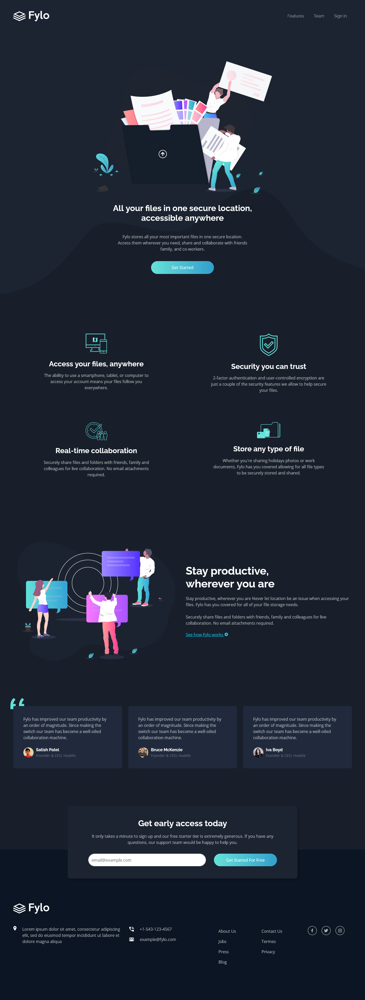

# Frontend Mentor - Fylo dark theme landing page solution

This is a solution to the [Fylo dark theme landing page challenge on Frontend Mentor](https://www.frontendmentor.io/challenges/fylo-dark-theme-landing-page-5ca5f2d21e82137ec91a50fd). Frontend Mentor challenges help you improve your coding skills by building realistic projects. 

## Table of contents

- [Overview](#overview)
  - [The challenge](#the-challenge)
  - [Screenshot](#screenshot)
  - [Links](#links)
- [My process](#my-process)
  - [Built with](#built-with)
  - [Useful resources](#useful-resources)
- [Author](#author)

## Overview

### The challenge

Users should be able to:

- View the optimal layout for the site depending on their device's screen size
- See hover states for all interactive elements on the page

### Screenshot

### Links

- [Solution URL here](https://github.com/mooktar/fylo-dark-theme-landing-page)
-  [Live site URL here](https://fylo-dark-theme-landing-page-black.vercel.app/)

## My process

### Built with

- Semantic HTML5 markup
- CSS custom properties using bootstrap 5
- Flexbox

### Useful resources

- [Bootstrap v5](https://getbootstrap.com/docs/v5.0/) - By using the sass bootstrap to customize quickly my own css files
- **Boxicons**

## Author

- Website - [Mooktar](https://mooktar.github.io)
- Frontend Mentor - [@mooktar](https://www.frontendmentor.io/profile/mooktar)
- Twitter - [@mooktar_dev](https://www.twitter.com/mohmouktar)
